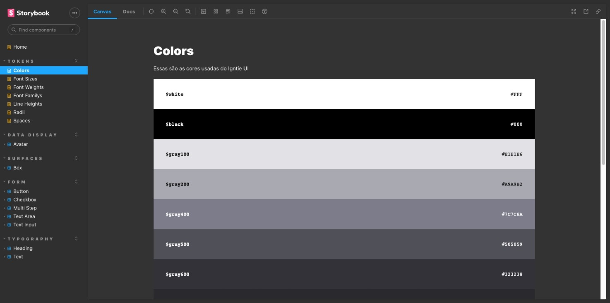

# Design System Ignite UI

<p align="center">
  
</p>

This design system was created during a course produced by Rocketseat, it was created in a monorepo that uses TurboRepo to manage the monorepo, we created token packages and the react package in addition to the project docs that were created using Storybook, for better development they were used TypeScript, TSUP and ESLint. Stitches was used for styling. The project is in NPM, for deployment we use Github Actions with the Changesets Release Action tool to help versioning`

## Technologies used in the project

- Storybook
- TypeScript
- TSUP
- Stitches
- TurboRepo
- Radix UI
- Polished
- EsLint

## Getting Started

First, run the development server:

```bash
npm install
npm run dev
# or
yarn install
yarn dev
```

Install package:

```bash
npm i @ignite_ui/react
npm i @ignite_ui/tokens
```

Thanks🤙